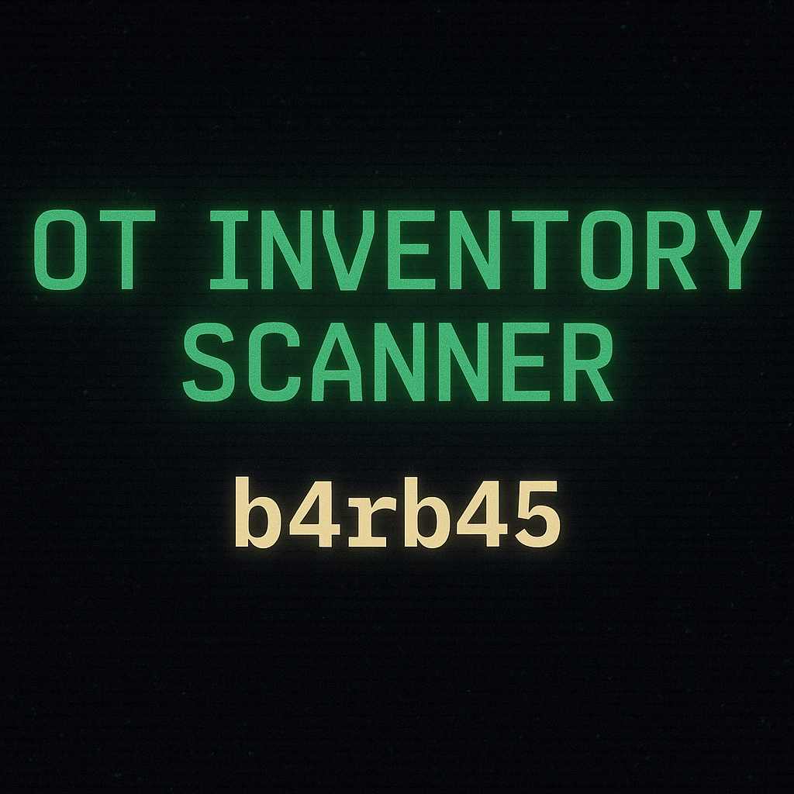

# OT Inventory Scanner — b4rb45 edition

🔥 Offensive OT/ICS Recon Tool built for serious SCADA mapping 🔥  
Scan & fingerprint industrial control system devices over TCP/UDP (Modbus, BACnet, DNP3, S7Comm, EtherNet/IP, and more).

## Features
- 🧠 Detects real industrial protocols
- 🔍 Fingerprints and marks potential honeypots
- ⚙️ Multithreaded with optional stealth mode
- 📜 Dynamic port loading from `.txt`
- ✅ TCP + UDP support

## Usage
```bash
git clone https://github.com/yourname/ot-inventory-scanner.git
cd ot-inventory-scanner
pip install -r requirements.txt
python3 scanner.py
```
...
